# 🛡️ EthGuardian AI
### 🔗 ₿ Ethereum Blockchain Forensics & Anti-Money Laundering Detection 💎

<div align="center">

**🚨 AI-Powered Ethereum Guardian - Protecting Blockchain Integrity 🚨**

*"Protecting Ethereum, One Block at a Time"*

[](https://www.python.org/)
[](https://fastapi.tiangolo.com/)
[](https://neo4j.com/)
[](https://reactjs.org/)
[](https://ethereum.org/)


---

> ### ⚠️ **REAL BLOCKCHAIN DATA - NOT SYNTHETIC**
> This platform connects directly to **Ethereum Mainnet** via Etherscan API.  
> All data is **REAL** - verify any transaction on [Etherscan.io](https://etherscan.io)

---

*🤖 Autonomous blockchain analysis platform that detects suspicious patterns, maps criminal networks, and tracks illicit fund flows using graph analytics and machine learning.*

**🎯 [Features](#-key-features) • 🏗️ [Architecture](#-system-architecture) • ⚡ [Quick Start](#-quick-start) • 📚 [API Docs](#-api-documentation) • 🤖 [Automation](#-automation-modes)**

</div>

---

## 📋 Table of Contents

- [🎯 Overview](#-overview)
- [🚀 Key Features](#-key-features)
- [🏗️ System Architecture](#-system-architecture)
- [🔍 Detection Capabilities](#-detection-capabilities)
- [🤖 Automation Modes](#-automation-modes)
- [⚡ Quick Start](#-quick-start)
- [📚 API Documentation](#-api-documentation)
- [💡 Usage Examples](#-usage-examples)
- [🕸️ Graph Visualizations & Neo4j Queries](#️-graph-visualizations--neo4j-queries)
- [🛠️ Technology Stack](#-technology-stack)
- [📁 Project Structure](#-project-structure)
- [⚙️ Configuration](#-configuration)
- [⚠️ Known Limitations](#️-known-limitations)
- [🎯 Use Cases & Real-World Applications](#-use-cases--real-world-applications)
- [🗺️ Roadmap](#️-roadmap)
- [📜 License](#-license)
- [🤝 Contributing](#-contributing)

---

## 🎯 Overview

**EthGuardian AI** is a sophisticated blockchain forensics tool designed for financial investigators, compliance officers, and researchers. It combines **graph analytics**, **pattern recognition**, and **autonomous exploration** to identify money laundering activities on the Ethereum blockchain.

### 💎 What Makes It Unique?

```
🔗 BLOCKCHAIN          🕵️ FORENSICS         🤖 AI-POWERED         📊 VISUALIZATION
   Ethereum              10 Algorithms        Auto-Expand           Interactive
   Etherscan             Graph Analytics      Risk Scoring          Force Graph
   Real-time             Pattern Match        Neo4j GDS             Real-time UI
```

- 🤖 **Autonomous Investigation**: Three automation modes (Crawler, Monitor, Expansion)
- 🕸️ **Graph-Based Analysis**: Neo4j database with relationship mapping
- 🎯 **10 Detection Algorithms**: Structuring, peel chains, mixers, taint, circularity, velocity, dormancy, round amounts, timing patterns, wash trading
- 📊 **Behavioral Analytics**: Transaction velocity, dormant account detection, burst activity patterns
- 🚨 **Alert System**: Neo4j-based alerts with risk scoring
- 📈 **Risk Scoring**: ML-based risk assessment for addresses
- 🔗 **Real Blockchain Data**: Direct Etherscan API V2 integration
- 📊 **Interactive Visualization**: Force-directed graph with react-force-graph
- ⚡ **Real-Time Analysis**: Analyze any Ethereum address on-demand

---

## 🚀 Key Features

### 💎 Core Capabilities

| 🔧 Feature | 📝 Description | 🎯 Benefit |
|---------|-------------|-----------|
| **⛓️ Transaction Ingestion** | Fetches complete transaction history from Etherscan API V2 | Complete blockchain visibility |
| **🎯 AML Pattern Detection** | 10 algorithms: Structuring, peel chains, mixers, taint, circularity, velocity, dormancy, round amounts, timing, wash trading | Detect money laundering techniques |
| **📊 Behavioral Analytics** | Transaction velocity, dormant account detection, burst activity patterns | Understand suspicious behavior |
| **🕸️ Graph Database** | Neo4j with relationship mapping and path analysis | Network visualization |
| **🚨 Alert System** | Neo4j-based alerts with risk scoring and thresholds | Automated detection |
| **🤖 Automation Modes** | Crawler (BFS/DFS), Monitor (continuous tracking), Auto-Expansion | Autonomous investigation |
| **📈 Risk Scoring** | ML-based risk assessment with configurable thresholds | Prioritize investigations |
| **💻 Interactive Visualization** | Force-directed graph with risk-based coloring | Intuitive exploration |
| **📊 Address Profiling** | Transaction count, volume, balance, first/last seen | Complete address intelligence |

### 🔬 Detection Systems

#### 🌀 Pattern Detection Algorithms
- **Mixer Detection**: Identifies suspicious mixing patterns in transaction flows
- **Peel Chain Detection**: Tracks sequential transfers with decreasing amounts
- **Structuring Detection**: Identifies transactions split to avoid detection thresholds
- **Taint Analysis**: Traces fund origins and propagation through the network
- **Circularity Detection**: Finds suspicious circular payment patterns
- **Velocity Analysis**: Detects abnormally high transaction frequency
- **Dormant Accounts**: Identifies suddenly reactivated old accounts
- **Round Amounts**: Flags transactions with suspiciously round values
- **Timing Patterns**: Detects coordinated timing in transaction batches
- **Wash Trading**: Identifies self-trading patterns

### 🤖 Automation Modes

| 🎮 Mode | 🎯 Purpose | 💼 Use Case | 🔥 Power |
|------|---------|----------|--------|
| 🕷️ **Crawler** | Autonomous network mapping | Investigate criminal networks | ████████░░ 80% |
| 📡 **Monitor** | Real-time transaction watching | Track whale movements | ███████░░░ 70% |
| 🌳 **Expansion** | Reactive deep investigation | Expand from suspicious addresses | █████████░ 90% |

---

## 🏗️ System Architecture

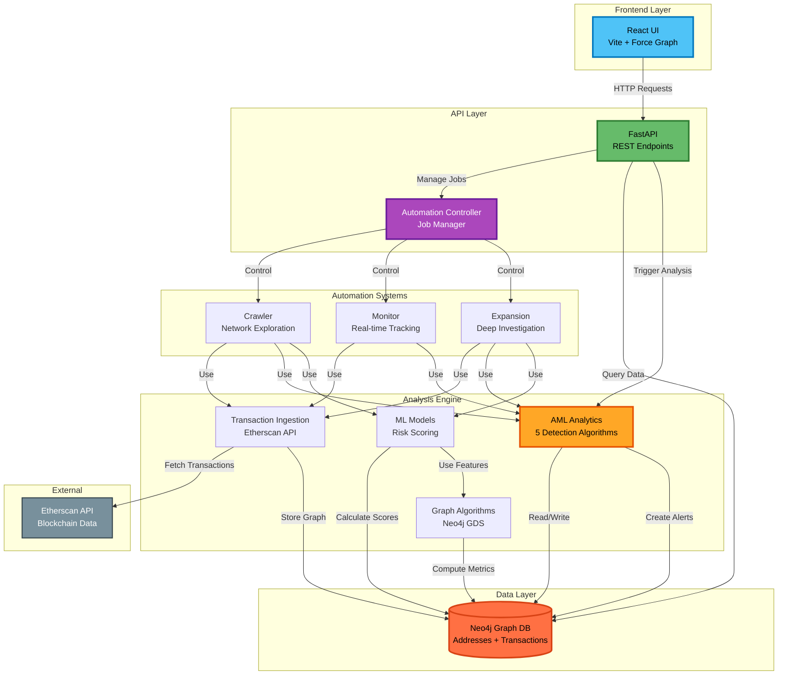

---

## 🔍 Detection Algorithms

### Analysis Flow

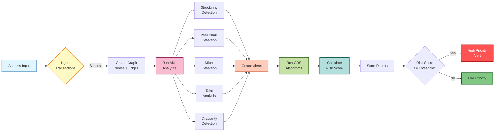

### 🎯 Detection Heuristics

#### 1. 🧩 Structuring Detection (Smurfing)
**🚨 What it detects:** Multiple small deposits in short timeframe to avoid detection limits

**🎯 Real-world example:** Breaking up $50k into 100 transactions of $500 each

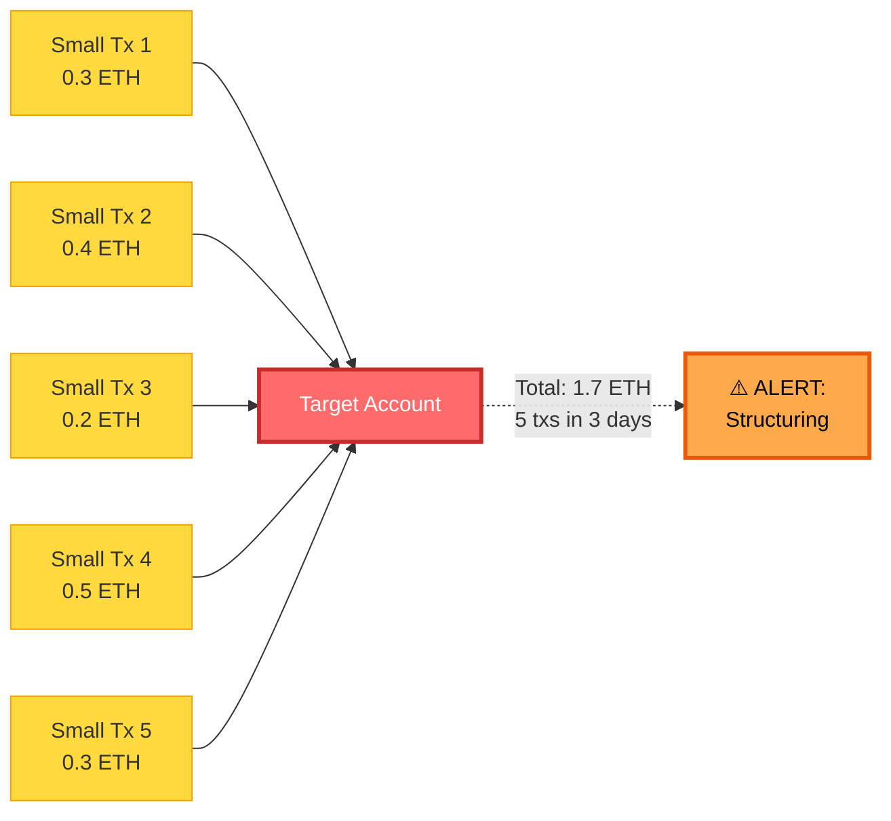

**Threshold:** 5+ transactions < 0.5 ETH within 3 days

---

#### 2. ⛓️ Peel Chain Detection (Layering)
**🚨 What it detects:** Sequential transfers with decreasing amounts to obscure origin

**🎯 Real-world example:** Stolen 100 ETH → 80 ETH → 60 ETH → 40 ETH (peeling off at each hop)

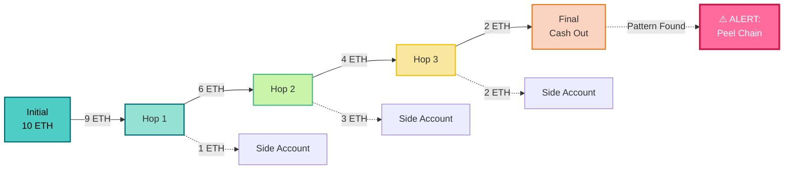

**Threshold:** 3+ hops with 70% value retention per hop

---

#### 3. 🌀 Mixer/Tumbler Detection
**🚨 What it detects:** High fan-in/fan-out patterns indicating cryptocurrency mixing service

**🎯 Real-world example:** Tornado Cash, ChipMixer (100+ connections in/out)

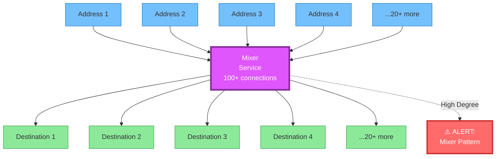

**Threshold:** Fan-in OR fan-out >= 20 addresses

---

#### 4. ☠️ Taint Analysis (Contamination)
**🚨 What it detects:** Proximity to sanctioned/hacked wallets (guilt by association)

**🎯 Real-world example:** Funds 2 hops away from North Korean Lazarus Group wallet

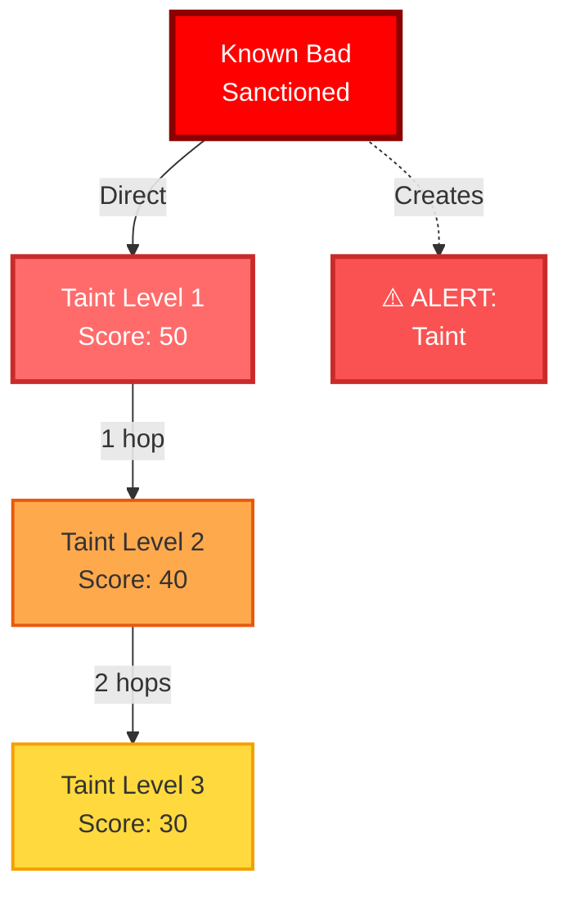

**Threshold:** Within 3 hops of sanctioned/flagged address

---

#### 5. 🔄 Circularity Detection (Round-Tripping)
**🚨 What it detects:** Funds making circular journeys back to origin

**🎯 Real-world example:** Wallet A → B → C → D → back to A (artificial volume)

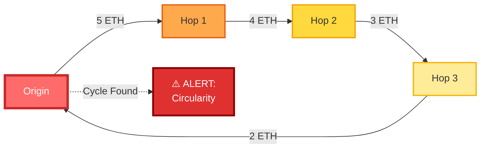

**Threshold:** 2-4 hop cycles detected

---

#### 6. ⚡ Velocity Alert (High-Frequency Trading)
**🚨 What it detects:** Rapid burst of transactions in short timeframe

**🎯 Real-world example:** 50+ transactions in 1 hour (bot activity, coordinated operations)

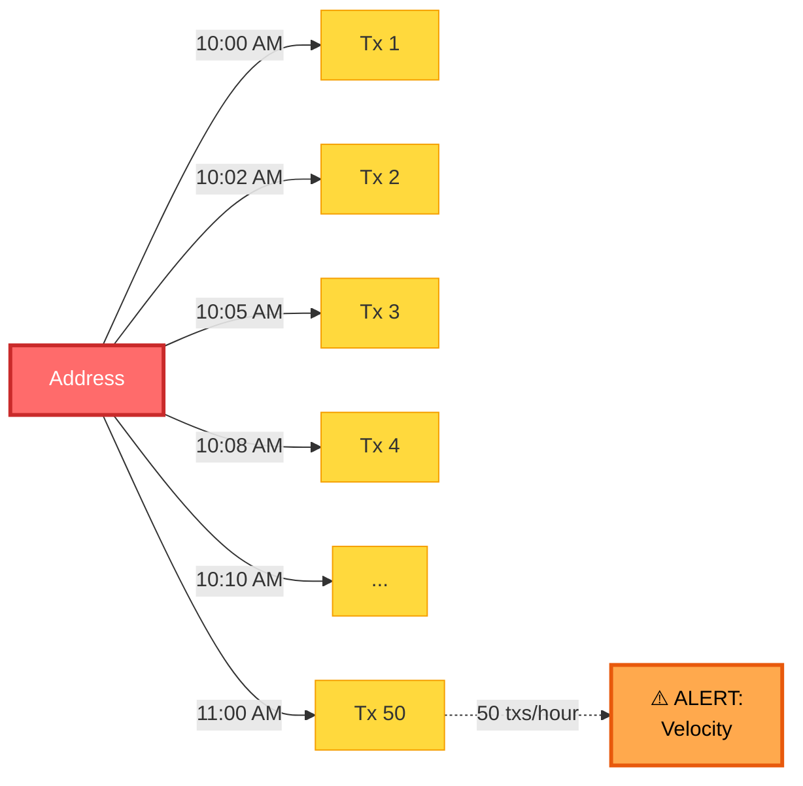

**Threshold:** 10+ transactions per hour

---

#### 7. 💤 Dormant Account Reactivation
**🚨 What it detects:** Long-inactive accounts suddenly active with large amounts

**🎯 Real-world example:** Account silent for 6 months, suddenly sends 10 ETH (hacked wallet)

**Threshold:** 6+ months dormant, then transaction >= 1 ETH

---

#### 8. 🎯 Round Amount Detection
**🚨 What it detects:** Suspiciously exact transaction amounts

**🎯 Real-world example:** Multiple transfers of exactly 1.0, 5.0, or 10.0 ETH (structured payments)

**Threshold:** 5+ round amount transactions (0.1, 0.5, 1.0, 2.0, 5.0, 10.0, 20.0, 50.0, 100.0 ETH)

---

#### 9. 🕐 Timing Pattern Detection
**🚨 What it detects:** Regular time intervals between transactions

**🎯 Real-world example:** Transactions every 2 hours like clockwork (automated bot)

**Threshold:** 10+ transactions with low time variance (< 1 hour std dev)

---

#### 10. 🔁 Wash Trading Detection
**🚨 What it detects:** Same addresses trading back and forth

**🎯 Real-world example:** Address A ⇄ Address B multiple times with similar amounts (volume manipulation)

**Threshold:** 3+ roundtrip transactions between same pair of addresses

---

## 🤖 Automation Modes

---

### 1. 🕷️ Crawler Mode - **Network Hunter**

**🎯 Purpose:** Autonomous network exploration starting from seed addresses

**💰 Perfect for:** Tracking stolen funds, mapping dark web markets, following ransomware payments

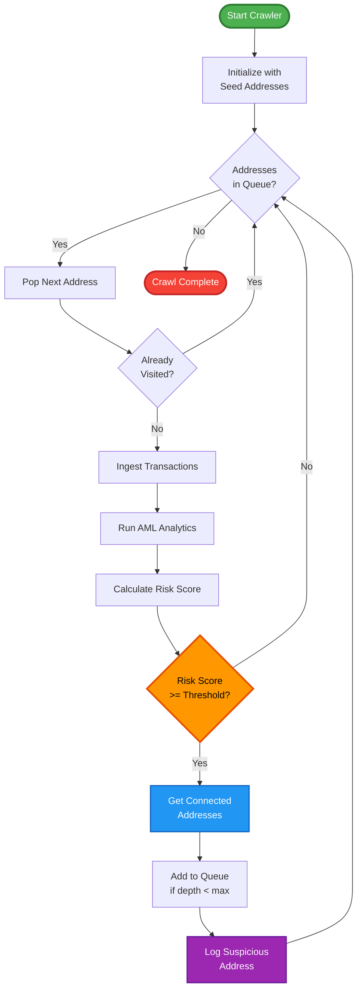

**Use Case:** Map entire money laundering network from known hacker wallet

---

## 🔍 Detection Capabilities

EthGuardian AI provides comprehensive detection and analysis capabilities for blockchain forensics and AML compliance.

### 🎯 Pattern Detection

Detect complex money laundering patterns using sophisticated algorithms:

#### **1. Layering Detection**
- Multiple rapid transfers in sequence
- Typical money laundering technique to obscure origin
- Configurable depth and time windows
- **API:** `GET /api/patterns/{address}/layering`

#### **2. Peel Chain Analysis**
- Gradual value separation (tumbling)
- Detect decreasing transaction patterns
- Common in crypto mixing operations
- **API:** `GET /api/patterns/{address}/peel-chains`

#### **3. Wash Trading Detection**
- Circular transactions between same parties
- Market manipulation indicator
- A→B→A patterns with similar amounts
- **API:** `GET /api/patterns/{address}/wash-trading`

#### **4. Round Amount Detection**
- Suspicious round numbers (1.0, 5.0, 10.0 ETH)
- Money launderers often use round amounts
- Statistical analysis of transaction values
- **API:** `GET /api/patterns/{address}`

#### **5. Time-based Anomalies**
- Activity during unusual hours (2am-6am)
- Weekend/holiday transaction patterns
- Burst activity detection
- **API:** `GET /api/analytics/{address}/burst-activity`

#### **6. Dust Attack Detection**
- Tiny amounts sent to track wallets
- Multiple dust transactions from different sources
- Privacy attack indicator
- **API:** `GET /api/patterns/{address}`

---


### 📊 Behavioral Analytics

Deep behavioral and temporal analysis:

#### **1. Transaction Velocity Analysis**
- How fast funds move through addresses
- Average residence time calculation
- High velocity indicates tumbling
- **API:** `GET /api/analytics/{address}/velocity`

#### **2. Dormancy Pattern Analysis**
- Detect wallets that suddenly activate
- Long-dormant addresses awakening
- Potential compromised accounts
- **API:** `GET /api/analytics/{address}/dormancy`

#### **3. Burst Activity Detection**
- Sudden spikes in transaction frequency
- Automated activity indicators
- Panic selling patterns
- **API:** `GET /api/analytics/{address}/burst-activity`

#### **4. Balance History Analysis**
- Track balance changes over time
- Detect unusual patterns
- Sudden increases/decreases
- **API:** `GET /api/analytics/{address}`

#### **5. Risk Progression Analysis**
- How risk has changed over time
- Early low risk → later high risk
- Account compromise indicators
- **API:** `GET /api/analytics/{address}`

---

### 📋 Alert System

Neo4j-based alerts with risk thresholds:

#### **Alert Types:**
- Pattern detection alerts (mixer, peel chain, structuring)
- Risk threshold alerts (high-risk addresses)
- Behavioral anomaly alerts (velocity, dormancy, wash trading)

#### **Configuration:**
Alerts are stored in Neo4j and accessible via API:
- **API:** `GET /api/alerts` - List all active alerts
- **API:** `GET /api/alerts/{address}` - Get alerts for specific address

---

### 📊 Analysis & Reporting

Generate analysis results in JSON format:

#### **Available Reports:**
1. **Address Profile** - Complete address intelligence
2. **Transaction Analysis** - Pattern detection results
3. **Risk Assessment** - ML-based risk scoring
4. **Network Analysis** - Graph relationship mapping

#### **Export Format:**
- **JSON** - Machine-readable API exports via standard endpoints

---

### 📊 Graph Analysis Tools

Advanced graph algorithms for investigations:

#### **1. Shortest Path**
Find shortest connection between two addresses
```http
GET /api/graph/shortest-path?from_address=0x...&to_address=0x...&max_hops=10
```

#### **2. Common Neighbors**
Identify shared connections between addresses
```http
GET /api/graph/common-neighbors?address1=0x...&address2=0x...
```

#### **3. Community Detection**
Detect gangs/groups using Louvain clustering
```http
GET /api/graph/community/{address}?depth=2
```

#### **4. Betweenness Centrality**
Identify hub/bridge addresses in network
```http
GET /api/graph/betweenness/{address}
```

#### **5. Clustering Coefficient**
Measure how tightly connected neighbors are
```http
GET /api/graph/clustering/{address}
```

#### **6. Triangle Detection**
Find wash trading rings (A→B→C→A patterns)
```http
GET /api/graph/triangles/{address}
```

#### **7. Ego Network**
Get address-centric subgraph
```http
GET /api/graph/ego-network/{address}?depth=2
```

---

### 🎯 Comprehensive Analysis

Execute complete forensic analysis in one call:

```bash
GET /api/comprehensive/{address}
```

**Returns all modules:**
- Pattern detection (10 AML algorithms: structuring, peel chains, mixers, taint, circularity, velocity, dormancy, round amounts, timing, wash trading)
- Behavioral analytics (velocity, dormancy, burst activity patterns)
- Risk scoring (ML-based assessment)
- Graph analysis (network relationships)
- Alert generation (Neo4j-based alerts)

---

### 🌀 Detection Examples

#### **Mixer Detection**
Detect interaction with Tornado Cash and other mixers:
```bash
GET /api/advanced/mixer/{address}
```

**Returns:**
- Known mixer addresses detected
- Number of hops to mixer
- Total value sent to mixers
- Risk score (direct interaction = very high risk)


## 🤖 Automation Modes

### 1. 🕷️ Crawler Mode - **Network Mapper**

**🎯 Purpose:** Autonomous exploration starting from seed addresses

**💰 Perfect for:** Mapping criminal networks, discovering connected wallets

---

### 2. 📡 Monitor Mode - **Blockchain Watchdog**

**🎯 Purpose:** Real-time monitoring of high-value transactions

**💰 Perfect for:** Exchange monitoring, whale tracking, compliance surveillance

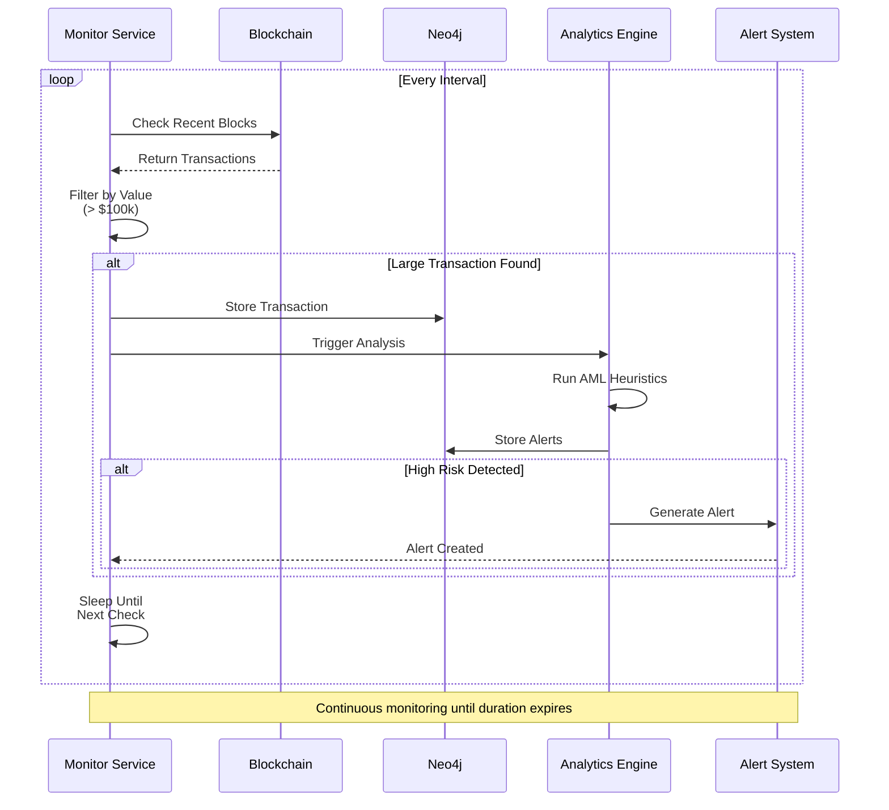

**Use Case:** Track large withdrawals from exchanges, detect whale movements

---

### 3. 🌳 Expansion Mode - **Deep Investigator**

**🎯 Purpose:** Deep investigation with automatic expansion on high-risk findings

**💰 Perfect for:** Forensic analysis, investigating specific suspect wallets, building case evidence

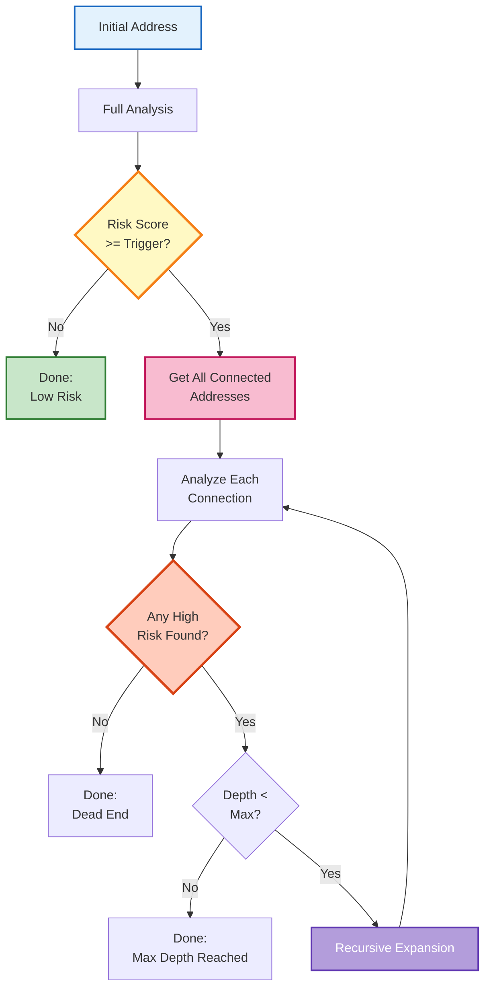

**Use Case:** Investigate suspicious address, automatically follow connected accounts if risky

---

## ⚡ Quick Start

### 🔧 Prerequisites

```bash
# 💻 Required Software
⚙️  Python 3.13+
⚙️  Node.js 18+
🗄️  Neo4j 5.x (Graph Database)
🔑 Etherscan API Key (Free tier works!)
```

**💡 Estimated Setup Time:** 15 minutes

### Installation

**1. Clone Repository**
```bash
git clone <repository-url>
cd aml-graph-platform
```

**2. Setup Backend**
```bash
cd backend
python3 -m venv venv
source venv/bin/activate  # On Windows: venv\Scripts\activate
pip install fastapi uvicorn neo4j requests pydantic python-dotenv scikit-learn graphdatascience

# Create .env file
echo "NEO4J_URI=bolt://localhost:7687
NEO4J_USER=neo4j
NEO4J_PASSWORD=your_password
ETHERSCAN_API_KEY=your_api_key" > .env
```

**3. Setup Frontend**
```bash
cd ../frontend
npm install
```

**4. Start Neo4j**
```bash
neo4j start
# Access Neo4j Browser at http://localhost:7474
# Set initial password
```

**5. Install Neo4j GDS Plugin** (Optional but recommended)
```bash
# Download from: https://neo4j.com/deployment-center/
# Place in Neo4j plugins directory
neo4j restart
```

### Running the Platform

**Terminal 1: Backend**
```bash
cd backend
source venv/bin/activate
uvicorn main:app --reload --host 0.0.0.0 --port 8001
```

**Terminal 2: Frontend**
```bash
cd frontend
npm run dev
```

**🌐 Access Points:**
```
🎨 Frontend UI:        http://localhost:5173
🚀 Backend API:        http://localhost:8001
📊 Interactive Docs:   http://localhost:8001/docs (Swagger)
🗄️ Neo4j Browser:      http://localhost:7474
🔍 Neo4j Bloom:        http://localhost:7474/browser (Graph Viz)
```

---

## 📚 API Documentation

---

### 🔗 Core Endpoints

#### 💎 Ingest Address
```http
POST /api/ingest/{address}
```
Fetches transaction history from Etherscan and stores in Neo4j graph.

**Example:**
```bash
curl -X POST http://localhost:8001/api/ingest/0xd8dA6BF26964aF9D7eEd9e03E53415D37aA96045
```

**Response:**
```json
{
  "ok": true,
  "ingested": 347
}
```

---

#### 🔍 Analyze Address
```http
POST /api/analyze/{address}
```
Runs all AML analytics and calculates risk score.

**Example:**
```bash
curl -X POST http://localhost:8001/api/analyze/0xd8dA6BF26964aF9D7eEd9e03E53415D37aA96045
```

**Response:**
```json
{
  "ok": true,
  "analytics": {
    "structuring": [],
    "peel_chains": [["0x...", 85.0]],
    "mixer_activity": [["0x...", 60.0]],
    "taint": [],
    "circularity": [],
    "velocity_alert": [["0x...", 55.0]],
    "dormant_reactivation": [],
    "round_amounts": [["0x...", 35.0]],
    "timing_patterns": [],
    "wash_trading": [["0x...", 70.0]]
  },
  "risk_score": 78.5
}
```

---

#### 🚨 Get Alerts
```http
GET /api/alerts
```
Returns all generated alerts ordered by recency.

**Response:**
```json
{
  "alerts": [
    {
      "id": "PEEL_CHAIN:0x...:1705670400000",
      "address": "0x...",
      "type": "PEEL_CHAIN",
      "score": 85.0,
      "created_at": 1705670400000
    }
  ]
}
```

---

#### 👤 Get Address Profile
```http
GET /api/address/{address}/profile
```
Returns detailed profile with risk score and graph metrics.

**Response:**
```json
{
  "address": "0x...",
  "risk_score": 72.5,
  "features": {
    "pagerank": 0.0045,
    "degree": 45,
    "inDegree": 23,
    "outDegree": 22,
    "louvain": 5,
    "triangles": 12
  },
  "stats": {
    "fanin_addresses": 23,
    "fanout_addresses": 22,
    "total_in_eth": 1247.5,
    "total_out_eth": 1198.3
  }
}
```

---

#### 🕸️ Get Address Graph
```http
GET /api/address/{address}/graph?hops=2
```
Returns graph visualization data for connected addresses.

**Parameters:**
- `hops`: Number of hops to explore (1-3)

**Response:**
```json
{
  "nodes": [
    {
      "id": "0x...",
      "label": "0xd8dA6...",
      "risk_score": 72.5
    }
  ],
  "links": [
    {
      "source": "0x...",
      "target": "0x...",
      "label": "TRANSFER",
      "count": 15,
      "value_sum": 45.3
    }
  ]
}
```

---

### 🤖 Automation Endpoints

#### 🕷️ Start Crawler
```http
POST /api/automation/crawler
```

**Request Body:**
```json
{
  "seed_addresses": ["0x...", "0x..."],
  "max_depth": 3,
  "min_value_eth": 1.0,
  "min_risk_score": 60.0,
  "max_addresses": 5000,
  "run_async": true
}
```

---

#### 📡 Start Monitor
```http
POST /api/automation/monitor
```

**Request Body:**
```json
{
  "min_value_usd": 100000,
  "check_interval_minutes": 60,
  "duration_hours": 24,
  "run_async": true
}
```

---

#### 🌳 Start Expansion
```http
POST /api/automation/expansion
```

**Request Body:**
```json
{
  "address": "0x...",
  "trigger_score": 70.0,
  "expansion_depth": 2,
  "min_value_eth": 0.5,
  "run_async": true
}
```

---

#### 📋 List Jobs
```http
GET /api/automation/jobs?job_type=crawler
```

---

#### 📊 Get Job Status
```http
GET /api/automation/jobs/{job_id}
```

**Response:**
```json
{
  "ok": true,
  "job": {
    "job_id": "crawler_20250119_120530_1",
    "type": "crawler",
    "status": "completed",
    "started_at": "2025-01-19T12:05:30Z",
    "completed_at": "2025-01-19T12:45:12Z",
    "params": { ... },
    "result": {
      "stats": {
        "addresses_analyzed": 347,
        "suspicious_found": 23,
        "total_alerts": 45
      },
      "suspicious_addresses": [ ... ]
    }
  }
}
```

---

## 💡 Usage Examples

---

### 🔍 Example 1: Investigate Suspicious Wallet

```bash
# Step 1: Ingest transaction history
curl -X POST http://localhost:8001/api/ingest/0xSUSPICIOUS_ADDRESS

# Step 2: Run analysis
curl -X POST http://localhost:8001/api/analyze/0xSUSPICIOUS_ADDRESS

# Step 3: Get detailed profile
curl http://localhost:8001/api/address/0xSUSPICIOUS_ADDRESS/profile

# Step 4: Visualize connections
curl http://localhost:8001/api/address/0xSUSPICIOUS_ADDRESS/graph?hops=2

# Step 5: Check generated alerts
curl http://localhost:8001/api/alerts
```

---

### 🕸️ Example 2: Map Criminal Network

```bash
# Start crawler from known hacker address
curl -X POST http://localhost:8001/api/automation/crawler \
  -H "Content-Type: application/json" \
  -d '{
    "seed_addresses": ["0xHACKER_WALLET"],
    "max_depth": 4,
    "min_risk_score": 55,
    "max_addresses": 10000,
    "run_async": true
  }'

# Check progress
curl http://localhost:8001/api/automation/jobs/{job_id}

# View all discovered suspicious addresses in Neo4j Browser
```

---

### 💰 Example 3: Monitor Exchange Withdrawals

```bash
# Start 24-hour monitor for large transactions
curl -X POST http://localhost:8001/api/automation/monitor \
  -H "Content-Type: application/json" \
  -d '{
    "min_value_usd": 500000,
    "check_interval_minutes": 15,
    "duration_hours": 24,
    "run_async": true
  }'

# Alerts appear automatically in frontend
```

---

### 🎯 Example 4: Deep Investigation with Auto-Expansion

```bash
# Start expansion from suspicious address
curl -X POST http://localhost:8001/api/automation/expansion \
  -H "Content-Type: application/json" \
  -d '{
    "address": "0xMIXER_SERVICE",
    "trigger_score": 70,
    "expansion_depth": 3,
    "run_async": true
  }'

# Get complete investigation tree
curl http://localhost:8001/api/automation/jobs/{job_id}
```

---

## 🕸️ Graph Visualizations & Neo4j Queries

### 📊 **Real Blockchain Data - Vitalik Buterin's Address**

We've ingested and analyzed **Vitalik Buterin's actual Ethereum address** to demonstrate the platform's capabilities with real-world data:

```
Address: 0xd8dA6BF26964aF9D7eEd9e03E53415D37aA96045
Network: Ethereum Mainnet
Data Ingested: 9,646 real transactions
Connected Addresses: 6,333 unique addresses
```

**🎯 Why Vitalik?**
- ✅ Public figure with transparent blockchain activity
- ✅ High-profile address with diverse transaction patterns
- ✅ Perfect baseline for comparing normal vs. suspicious behavior
- ✅ Demonstrates the system's ability to handle complex real-world networks

---

### 🎨 **Neo4j Visualization Gallery**

Below are real graph visualizations from Neo4j Browser showing various AML detection patterns:

<div align="center">

#### 🌐 **Network Overview - 2 Level Connections**
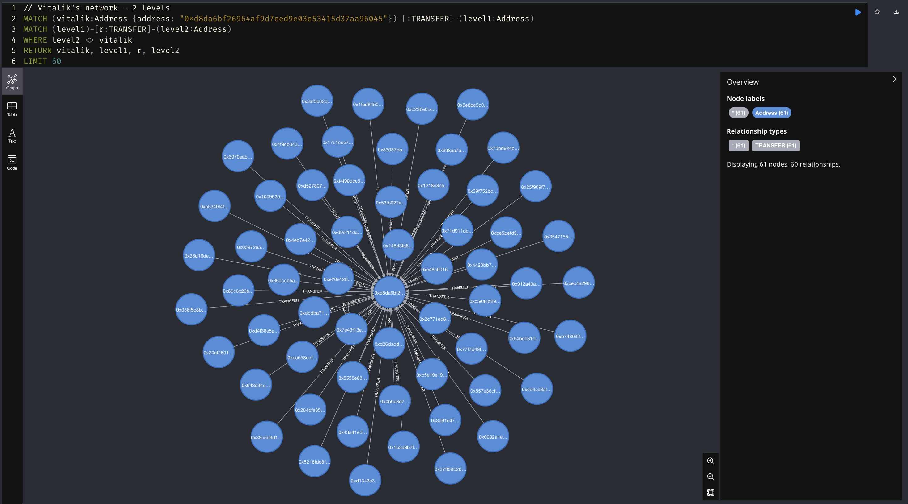

*Vitalik's network expanded to 2 levels, revealing indirect connections and potential intermediary addresses.*

---

#### 💰 **Money Flow Analysis - Large Transactions**
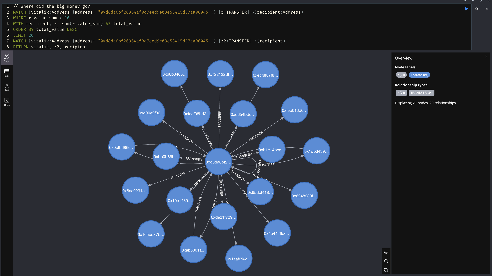

*Color-coded by transaction value: Red = High value (>50 ETH), Yellow = Medium, Green = Small*

---

#### 🌀 **Hub Detection - Mixer Patterns**
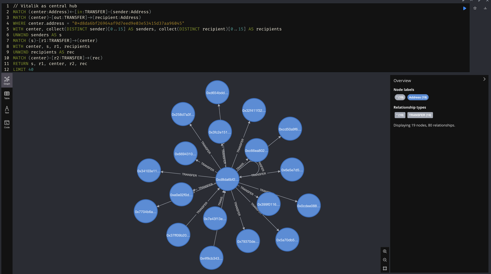

*Central nodes with high connectivity indicate possible exchanges or mixer services*

---

#### ⛓️ **Peel Chain Detection - Layering**
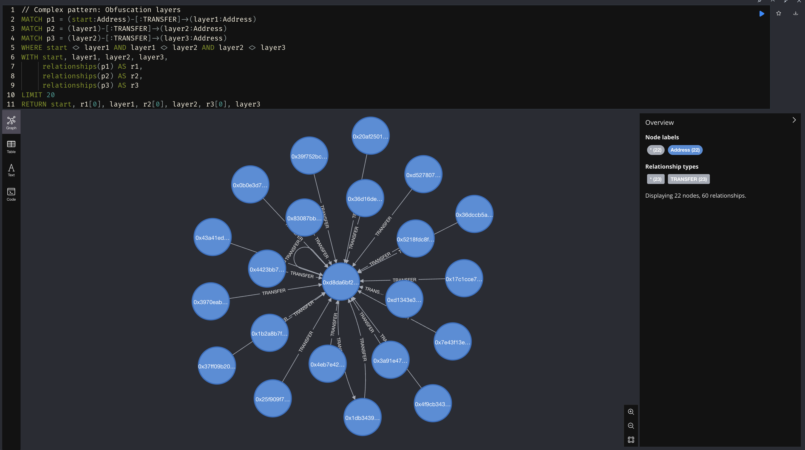

*Sequential transactions showing potential layering behavior (A → B → C → D)*

---

#### 🔄 **Circularity Analysis - Fund Loops**
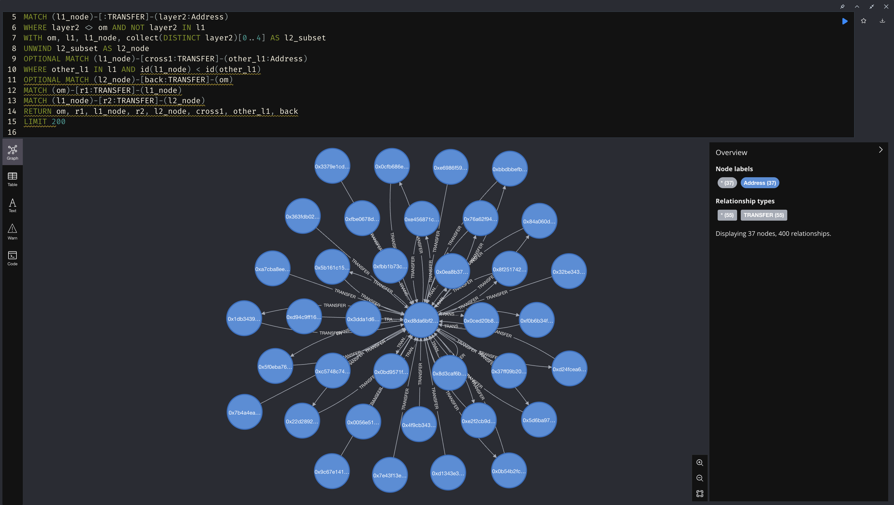

*Detecting cycles where funds return to origin (A → B → C → A)*

---

#### 🎯 **Round Amount Detection**
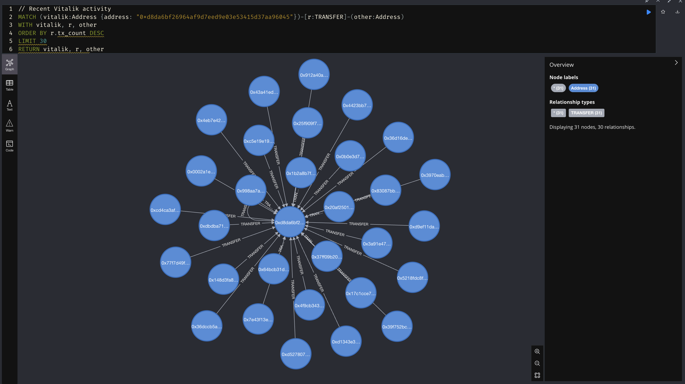

*Transactions with suspiciously exact values (1.0, 5.0, 10.0 ETH) indicating potential structuring*

</div>

---

### 📋 **Complete Neo4j Query Collection**

Access Neo4j Browser at `http://localhost:7474` and use these queries:

**Login Credentials:**
```
URL: neo4j://localhost:7687
Username: neo4j
Password: neo4j123
```

---

#### 🔍 **Basic Exploration Queries**

**1. General Statistics**
```cypher
// View dataset statistics
MATCH (a:Address) WITH count(a) AS addresses
MATCH (t:Transaction) WITH addresses, count(t) AS transactions  
RETURN addresses, transactions
```

**2. Vitalik's Direct Network**
```cypher
// Vitalik and his direct connections
MATCH (vitalik:Address {address: "0xd8da6bf26964af9d7eed9e03e53415d37aa96045"})
MATCH (vitalik)-[r:TRANSFER]-(other:Address)
RETURN vitalik, r, other
LIMIT 50
```

**3. Random Network Sample**
```cypher
// Random network exploration
MATCH (a:Address)-[r:TRANSFER]-(b:Address)
WHERE rand() < 0.01
RETURN a, r, b
LIMIT 40
```

---

#### 🚨 **AML Detection Patterns**

**4. STRUCTURING (Smurfing) - Many Small Transactions**
```cypher
// Find addresses receiving MANY small transactions
MATCH (suspicious:Address)<-[t:TRANSFER]-(sender:Address)
WHERE t.value_sum < 1.0
WITH suspicious, count(t) AS small_tx_count
WHERE small_tx_count > 50
RETURN suspicious.address AS suspect, small_tx_count
ORDER BY small_tx_count DESC
LIMIT 10
```

**Visualize:**
```cypher
MATCH (suspicious:Address {address: "PASTE_ADDRESS_HERE"})
MATCH (suspicious)<-[t:TRANSFER]-(sender:Address)
WHERE t.value_sum < 1.0
RETURN suspicious, t, sender
LIMIT 50
```

**5. PEEL CHAIN - Layering Through Intermediaries**
```cypher
// Find chains of 3+ levels (A → B → C → D)
MATCH path = (origin:Address)-[:TRANSFER*3..5]->(destination:Address)
WHERE origin <> destination
WITH path, length(path) AS hops
RETURN [n IN nodes(path) | n.address] AS chain, hops
LIMIT 10
```

**6. MIXER PATTERN - Hub Detection**
```cypher
// Find mixer-type addresses
MATCH (mixer:Address)
MATCH (sender:Address)-[:TRANSFER]->(mixer)
MATCH (mixer)-[:TRANSFER]->(recipient:Address)
WITH mixer, 
     count(DISTINCT sender) AS inputs,
     count(DISTINCT recipient) AS outputs
WHERE inputs > 20 AND outputs > 20
RETURN mixer.address, inputs, outputs
ORDER BY inputs DESC
LIMIT 5
```

**7. CIRCULARITY - Money Returns to Origin**
```cypher
// Find cycles (A → B → C → A)
MATCH path = (a:Address)-[:TRANSFER*2..4]->(a)
WHERE length(path) >= 2
WITH nodes(path) AS cycle_nodes, length(path) AS cycle_length
RETURN [n IN cycle_nodes | n.address] AS complete_cycle, cycle_length
LIMIT 10
```

**8. LARGE TRANSACTIONS (Whale Movements)**
```cypher
// Top 20 largest transactions
MATCH (from:Address)-[t:TRANSFER]->(to:Address)
WHERE t.value_sum > 100
RETURN from.address, to.address, t.value_sum AS eth
ORDER BY eth DESC
LIMIT 20
```

**9. ROUND AMOUNTS - Exact Values**
```cypher
// Find transactions with "round" values
MATCH (a:Address)-[t:TRANSFER]-(b:Address)
WHERE t.value_sum IN [1.0, 5.0, 10.0, 50.0, 100.0, 500.0]
RETURN a, t, b
LIMIT 40
```

**10. TIMING PATTERNS - Regular Intervals**
```cypher
// Find temporal patterns (same time)
MATCH (a:Address)-[:EMITTED]->(t:Transaction)
WITH a, datetime({epochSeconds: t.time}).hour AS hour, count(*) AS tx_count
WHERE tx_count > 5
RETURN a.address, hour AS suspicious_hour, tx_count
ORDER BY tx_count DESC
LIMIT 10
```

---

#### 🚀 **Advanced Forensic Queries**

**11. Money Flow - 2 Levels Deep**
```cypher
// Vitalik's network - 2 levels
MATCH (vitalik:Address {address: "0xd8da6bf26964af9d7eed9e03e53415d37aa96045"})
      -[:TRANSFER]-(level1:Address)-[r:TRANSFER]-(level2:Address)
WHERE level2 <> vitalik
RETURN vitalik, level1, r, level2
LIMIT 60
```

**12. Detect Mixers Connected to Target**
```cypher
// Find possible mixers connected to Vitalik
MATCH (vitalik:Address {address: "0xd8da6bf26964af9d7eed9e03e53415d37aa96045"})
      -[:TRANSFER]-(middle:Address)
MATCH (middle)-[r:TRANSFER]-(other:Address)
WITH middle, count(DISTINCT other) AS connections
WHERE connections > 50
MATCH (vitalik:Address {address: "0xd8da6bf26964af9d7eed9e03e53415d37aa96045"})
      -[r1:TRANSFER]-(middle)-[r2:TRANSFER]-(suspects:Address)
RETURN vitalik, r1, middle, r2, suspects
LIMIT 60
```

**13. Largest Money Flows**
```cypher
// Where did the big money go?
MATCH (vitalik:Address {address: "0xd8da6bf26964af9d7eed9e03e53415d37aa96045"})
      -[r:TRANSFER]-(other:Address)
WHERE r.value_sum > 10
RETURN vitalik, r, other
ORDER BY r.value_sum DESC
LIMIT 40
```

**14. Community Clusters**
```cypher
// Find densely connected communities
MATCH (vitalik:Address {address: "0xd8da6bf26964af9d7eed9e03e53415d37aa96045"})
      -[:TRANSFER]-(level1:Address)-[:TRANSFER]-(level2:Address)
WHERE level2 <> vitalik
WITH level1, level2, count(*) AS connections
WHERE connections > 3
MATCH (level1)-[r:TRANSFER]-(level2)
RETURN level1, r, level2
LIMIT 50
```

**15. Triangulation - Transaction Triangles**
```cypher
// Triangle patterns (A → B → C → A)
MATCH (vitalik:Address {address: "0xd8da6bf26964af9d7eed9e03e53415d37aa96045"})
      -[r1:TRANSFER]->(b:Address)-[r2:TRANSFER]->(c:Address)-[r3:TRANSFER]->(vitalik)
RETURN vitalik, r1, b, r2, c, r3
LIMIT 20
```

---

#### 🔥 **Professional Forensics - Advanced Patterns**

**16. Genetic Tracing - Money Lineage**
```cypher
// Follow money "DNA" through 5 levels
MATCH path = (origin:Address)-[:TRANSFER*3..5]->(destination:Address)
WHERE origin <> destination
WITH path, nodes(path) AS chain, length(path) AS depth
WHERE depth >= 4
WITH chain, relationships(path) AS rels, 
     reduce(total = 0.0, r IN rels | total + r.value_sum) AS total_value
WHERE total_value > 5
UNWIND range(0, size(chain)-2) AS i
WITH DISTINCT chain[i] AS node1, rels[i] AS rel, chain[i+1] AS node2
RETURN node1, rel, node2
LIMIT 60
```

**17. Whale Surveillance**
```cypher
// Find big players and their networks
MATCH (whale:Address)-[big:TRANSFER]-(other:Address)
WHERE big.value_sum > 50
WITH whale, sum(big.value_sum) AS total_volume, count(other) AS connections
WHERE total_volume > 200 AND connections > 10
ORDER BY total_volume DESC
LIMIT 5
MATCH (whale)-[r:TRANSFER]-(network:Address)
WHERE r.value_sum > 10
RETURN whale, r, network
LIMIT 50
```

**18. Velocity Analysis - High Frequency**
```cypher
// Addresses with MANY transactions (bot/automation)
MATCH (fast:Address)-[r:TRANSFER]-(other:Address)
WITH fast, count(r) AS tx_count
WHERE tx_count > 50
ORDER BY tx_count DESC
LIMIT 10
MATCH (fast)-[rel:TRANSFER]-(network:Address)
WITH fast, rel, network, rand() AS random
WHERE random < 0.4
RETURN fast, rel, network
LIMIT 60
```

**19. Taint Analysis - Contamination**
```cypher
// Find who is 2-3 hops from suspicious hubs
MATCH (hub:Address)-[:TRANSFER]-(other:Address)
WITH hub, count(other) AS connections
WHERE connections > 100
ORDER BY connections DESC
LIMIT 3
MATCH path = (hub)-[:TRANSFER*2..3]-(contaminated:Address)
WHERE contaminated <> hub
WITH contaminated, count(path) AS paths_from_hub
WHERE paths_from_hub > 2
MATCH (contaminated)-[r:TRANSFER]-(network:Address)
RETURN contaminated, r, network
LIMIT 50
```

**20. ULTIMATE FORENSIC QUERY - Everything Together**
```cypher
// Master query: find EVERYTHING suspicious
CALL {
  // Mixers
  MATCH (m:Address)-[:TRANSFER]-(o:Address)
  WITH m, count(DISTINCT o) AS c
  WHERE c > 50
  RETURN m AS suspect, 'MIXER' AS reason, c AS score
  LIMIT 5
  
  UNION
  
  // Round values
  MATCH (a)-[t:TRANSFER {value_sum: 10.0}]-(b)
  WITH a, count(t) AS c
  WHERE c > 5
  RETURN a AS suspect, 'ROUND_VALUES' AS reason, c AS score
  LIMIT 5
  
  UNION
  
  // High frequency
  MATCH (h)-[r:TRANSFER]-()
  WITH h, count(r) AS c
  WHERE c > 100
  RETURN h AS suspect, 'HIGH_VELOCITY' AS reason, c AS score
  LIMIT 5
}
WITH suspect, reason, score
ORDER BY score DESC
MATCH (suspect)-[r:TRANSFER]-(network:Address)
RETURN suspect, r, network, reason
LIMIT 60
```

---

### 🎯 **Next Addresses to Analyze**

We plan to ingest and analyze these famous Ethereum addresses:

| Address | Owner | Type | Interest Level |
|---------|-------|------|----------------|
| `0x28C6c06298d514Db089934071355E5743bf21d60` | **Binance Hot Wallet** | Exchange | 🔥🔥🔥🔥🔥 |
| `0x722122dF12D4e14e13Ac3b6895a86e84145b6967` | **Tornado Cash** | Mixer (Sanctioned) | 🔥🔥🔥🔥🔥 |
| `0x098B716B8Aaf21512996dC57EB0615e2383E2f96` | **Ronin Bridge Hacker** | Exploit ($600M) | 🔥🔥🔥🔥 |
| `0x7a250d5630B4cF539739dF2C5dAcb4c659F2488D` | **Uniswap V2 Router** | DEX | 🔥🔥🔥🔥 |
| `0x71660c4005BA85c37ccec55d0C4493E66Fe775d3` | **Coinbase Hot Wallet** | Exchange | 🔥🔥🔥 |
| `0xC50A8d4f8D68f946f69533b78Ba1f91F8a4c94aC` | **PolyNetwork Hacker** | White Hat | 🔥🔥🔥 |
| `0xbe0eb53f46cd790cd13851d5eff43d12404d33e8` | **Binance Hot Wallet 14** | Exchange | 🔥🔥 |
| `0x00000000219ab540356cBB839Cbe05303d7705Fa` | **ETH 2.0 Deposit** | Staking Contract | 🔥🔥 |

**Why These Addresses?**
- 🏦 **Exchanges**: Study high-volume legitimate patterns vs. wash trading
- 🌀 **Mixers**: Perfect example of obfuscation techniques
- 🏴‍☠️ **Hackers**: Real-world money laundering case studies
- 🦄 **DeFi**: Study how protocols are used for layering

---

### 📊 **Pattern Recognition Guide**

When visualizing graphs in Neo4j, look for these patterns:

| Visual Pattern | Indicates | Risk Level |
|----------------|-----------|------------|
| ⭐ **Star** (1 center, many spokes) | Mixer/Exchange | 🚨 HIGH |
| ⛓️ **Long Chain** (A→B→C→D→E) | Layering/Peel Chain | 🚨 HIGH |
| 🔄 **Circle** (A→B→C→A) | Wash Trading | 🚨 HIGH |
| 🌧️ **Rain** (many→1) | Structuring/Smurfing | 🚨 HIGH |
| 🎯 **Even Lines** (same thickness) | Round Amounts | ⚠️ MEDIUM |
| 🌐 **Sparse Network** | Normal Usage | ✅ LOW |

---

### 💡 **Tips for Neo4j Visualization**

1. **Click "Graph" view** (not "Table") in Neo4j Browser
2. **Drag nodes** to organize the layout
3. **Scroll to zoom** in and out
4. **Click nodes** to see properties
5. **Double-click nodes** to expand connections
6. **Use LIMIT** to control graph size (start with 30-50)
7. **Color interpretation**:
   - 🔴 Red nodes = High risk
   - 🟡 Yellow nodes = Medium risk
   - 🟢 Green nodes = Low risk

---

### 🚀 **Quick Start with Visualizations**

```bash
# 1. Start Neo4j Browser
open http://localhost:7474

# 2. Login with credentials above

# 3. Run this query for instant visual
MATCH (v:Address {address: "0xd8da6bf26964af9d7eed9e03e53415d37aa96045"})-[r:TRANSFER]-(o:Address)
RETURN v, r, o
LIMIT 50

# 4. Drag nodes to organize!
```

---

## 🛠️ Technology Stack

### 🔧 Backend Stack
| Technology | Purpose | Version |
|------------|---------|---------|
| ⚡ **FastAPI** | Modern async Python web framework | 0.119+ |
| 🗄️ **Neo4j** | Graph database for relationship mapping | 5.x |
| 📊 **Neo4j GDS** | Graph Data Science algorithms | Latest |
| 🤖 **Scikit-learn** | Machine learning utilities | 1.7+ |
| 🔐 **Python-dotenv** | Environment configuration | 1.1+ |
| 🌐 **Requests** | HTTP client for Etherscan API | 2.32+ |

### 🎨 Frontend Stack
| Technology | Purpose | Version |
|------------|---------|---------|
| ⚛️ **React 18** | Modern UI framework | 18.3+ |
| ⚡ **Vite** | Lightning-fast build tool | 5.4+ |
| 🕸️ **React Force Graph** | Interactive 3D/2D graph viz | 1.45+ |
| 🔗 **Axios** | Promise-based HTTP client | 1.7+ |
| 🎨 **CSS Grid/Flexbox** | Modern responsive layouts | Native |

### 🌐 External Services
| Service | Purpose | Tier |
|---------|---------|------|
| 🔷 **Etherscan API** | Ethereum blockchain data | Free/Pro |
| ⚡ **Bolt Protocol** | Neo4j connection | Native |
| 💎 **Ethereum Mainnet** | Live blockchain data | Public |

---

## 📁 Project Structure

```
aml-graph-platform/
├── backend/
│   ├── app/
│   │   ├── __init__.py
│   │   ├── aml_analytics.py      # 5 detection algorithms
│   │   ├── api.py                # FastAPI endpoints
│   │   ├── automation.py         # Job controller
│   │   ├── core.py               # Neo4j + Etherscan integration
│   │   ├── crawler.py            # Crawler mode
│   │   ├── expansion.py          # Expansion mode
│   │   ├── ml_models.py          # Risk scoring + GDS
│   │   ├── monitor.py            # Monitor mode
│   │   └── schemas.py            # Pydantic models
│   ├── main.py                   # FastAPI app entry
│   ├── requirements.txt
│   ├── .env                      # Configuration
│   └── AUTOMATION_README.md      # Automation docs
│
├── frontend/
│   ├── src/
│   │   ├── components/
│   │   │   ├── AddressProfile.jsx
│   │   │   ├── AlertQueue.jsx
│   │   │   ├── DashboardView.jsx
│   │   │   ├── GraphVisualizer.jsx
│   │   │   └── InvestigationView.jsx
│   │   ├── contexts/
│   │   │   └── InvestigationContext.jsx
│   │   ├── App.jsx
│   │   ├── index.css
│   │   └── main.jsx
│   ├── index.html
│   ├── package.json
│   └── vite.config.js
│
└── README.md                     # This file
```

---

## ⚙️ Configuration

### Environment Variables

Create `backend/.env`:

```env
# Neo4j Configuration
NEO4J_URI=bolt://localhost:7687
NEO4J_USER=neo4j
NEO4J_PASSWORD=your_secure_password

# Etherscan API
ETHERSCAN_API_KEY=your_api_key_here
```

### Etherscan API Setup

1. Visit https://etherscan.io/apis
2. Create free account
3. Generate API key
4. Free tier: 5 calls/sec, 100k calls/day
5. Consider Pro tier for production

### Neo4j GDS Installation

```bash
# Download GDS plugin
wget https://graphdatascience.ninja/neo4j-graph-data-science-[VERSION].jar

# Move to Neo4j plugins directory
mv neo4j-graph-data-science-*.jar $NEO4J_HOME/plugins/

# Restart Neo4j
neo4j restart

# Verify installation
CALL gds.version()
```

---

## 🎨 Frontend Features

### 🕸️ Interactive Graph Visualization

```
🎨 Visual Design:
├─ 🟢 Green Nodes  → Low Risk (0-30)
├─ 🟡 Yellow Nodes → Medium Risk (30-60)  
├─ 🟠 Orange Nodes → High Risk (60-80)
└─ 🔴 Red Nodes    → Critical Risk (80-100)
```

- **🎯 Color-coded nodes**: Green (low risk) → Red (high risk)
- **👆 Click to investigate**: Select any node to view details
- **⚡ Force-directed layout**: Automatic positioning with physics
- **🔍 Zoom & pan**: Explore large networks smoothly
- **💬 Hover tooltips**: Quick info on nodes/edges

### 🚨 Alert Queue

- ⚡ Real-time alert feed
- 📊 Severity scoring (0-100)
- 👆 Click to investigate
- 🕐 Timestamp tracking
- 🏷️ Alert type badges (MIXER, PEEL_CHAIN, etc.)

### 👤 Address Profile

- 📊 Risk score (0-100) with visual gauge
- 🕸️ Graph metrics (PageRank, Degree, Centrality)
- 💰 Transaction statistics (count, volume)
- 💎 Total ETH in/out with USD conversion
- 🗺️ Community detection results (Louvain clusters)

---

## 📊 Graph Metrics Explained

| 🎯 Metric | 📝 Description | 🔍 Use in AML | 💡 Example |
|--------|-------------|------------|---------|
| **📈 PageRank** | Node importance in network | Identifies central actors | Kingpin wallets |
| **🔗 Degree** | Number of connections | Detects mixers/hubs | Tornado Cash |
| **⬇️ InDegree** | Incoming connections | Identifies receivers | Exchange hot wallets |
| **⬆️ OutDegree** | Outgoing connections | Identifies senders | Scam distribution |
| **🗺️ Louvain** | Community detection | Maps criminal networks | Cartel clusters |
| **🔺 Triangle Count** | Number of triangles | Finds collusion patterns | Wash trading rings |

---

## 🚨 Detection Thresholds

### 📊 Core Detection Algorithms

| 🎯 Algorithm | ⚠️ Trigger Condition | 📊 Score Weight | 🔥 Severity |
|-----------|------------------|--------------|----------|
| 🧩 Structuring | 5+ txs < 0.5 ETH in 3 days | 20-40 | 🟡 Medium |
| ⛓️ Peel Chains | 3+ hops, 70% retention | 40-60 | 🟠 High |
| 🌀 Mixer Pattern | Fan-in/out >= 20 | 60-80 | 🔴 Critical |
| ☠️ Taint | Within 3 hops of flagged | 50-40-30 | 🟠 High |
| 🔄 Circularity | 2-4 hop cycles | 35-50 | 🟠 High |

### ⚡ Advanced Detection Algorithms (NEW!)

| 🎯 Algorithm | ⚠️ Trigger Condition | 📊 Score Weight | 🔥 Severity |
|-----------|------------------|--------------|----------|
| ⚡ Velocity Alert | 10+ txs per hour | 40-70 | 🟠 High |
| 💤 Dormant Reactivation | 6mo dormant + 1+ ETH tx | 35-65 | 🟠 High |
| 🎯 Round Amounts | 5+ exact amounts (1.0, 5.0 ETH) | 25-50 | 🟡 Medium |
| 🕐 Timing Patterns | 10+ txs regular intervals | 35-55 | 🟡 Medium |
| 🔁 Wash Trading | 3+ roundtrips same pair | 40-70 | 🟠 High |

**💎 Risk Score Formula:**
```python
Risk_Score = (
    0.30 × PageRank_normalized +      # Network importance
    0.15 × Degree_normalized +         # Connection count
    0.15 × Triangles_normalized +      # Collusion patterns
    0.10 × InDegree_normalized +       # Receiving activity
    0.10 × OutDegree_normalized +      # Sending activity
    min(40, alert_count × 10)          # Alert bonus (max 40)
) × 100  # Scale to 0-100

🟢 Low Risk:      0-30
🟡 Medium Risk:   30-60
🟠 High Risk:     60-80
🔴 Critical Risk: 80-100
```

---

## 🔒 Security Considerations

### ⚠️ Current Implementation
- 🔓 No authentication (add JWT/OAuth in production)
- 🚦 No rate limiting (add nginx reverse proxy)
- 🔑 API keys in .env (use secrets manager)
- 🌐 CORS wide open (restrict to specific origins)

### ✅ Production Recommendations
```python
# Add authentication
from fastapi.security import HTTPBearer

# Add rate limiting
from slowapi import Limiter

# Use secrets manager
import boto3
secrets = boto3.client('secretsmanager')
```

---

## 📈 Performance Optimization

### Database Indexes
```cypher
// Create indexes for fast lookups
CREATE INDEX address_index FOR (a:Address) ON (a.address);
CREATE INDEX tx_hash_index FOR (t:Transaction) ON (t.hash);
CREATE INDEX alert_time_index FOR (al:Alert) ON (al.created_at);
```

### Rate Limiting
- Etherscan: 5 calls/sec (free tier)
- Add 200ms delay between calls
- Implement exponential backoff on errors
- Cache frequently accessed data

### Scaling
- **Horizontal**: Run multiple crawler instances
- **Vertical**: Increase Neo4j memory
- **Caching**: Redis for API responses
- **Queue**: RabbitMQ for background jobs

---

## 🤝 Contributing

### Development Setup

```bash
# Install development dependencies
pip install black flake8 pytest

# Format code
black backend/

# Run linter
flake8 backend/

# Run tests
pytest backend/tests/
```

### Contribution Guidelines

1. Fork the repository
2. Create feature branch (`git checkout -b feature/AmazingFeature`)
3. Write tests for new features
4. Ensure all tests pass
5. Format code with Black
6. Commit changes (`git commit -m 'Add AmazingFeature'`)
7. Push to branch (`git push origin feature/AmazingFeature`)
8. Open Pull Request

---

## 📝 License

This project is licensed under the MIT License - see the [LICENSE](LICENSE) file for details.

---

## 🙏 Acknowledgments

- **Neo4j Graph Data Science** - Graph algorithms
- **Etherscan** - Blockchain data API
- **React Force Graph** - Visualization library
- **FastAPI** - Modern Python web framework

---

## 📞 Support

- 📖 **Documentation**: See `/backend/AUTOMATION_README.md` for automation details
- 🐛 **Bug Reports**: Open an issue on GitHub
- 💬 **Discussions**: Use GitHub Discussions
- 📧 **Contact**: [Your contact info]

---

## 🎓 Research & Use Cases

### 🎯 Academic Use
- 🔬 Blockchain forensics research
- 📊 Criminal network analysis
- 🧮 Graph theory applications
- 🤖 Machine learning in fintech
- 📚 Dataset generation for AML research

### 💼 Professional Use
- 🏦 Financial institution compliance (KYC/AML)
- 👮 Law enforcement investigations
- 💱 Cryptocurrency exchange monitoring
- 📋 Regulatory reporting (SAR/CTR/STR)
- 🔍 Private investigation firms
- 🛡️ Fraud detection teams

### ⚠️ Known Limitations
- 🔷 Ethereum only (Bitcoin, BSC, Polygon coming)
- 🌐 Relies on Etherscan API availability
- 🤖 GraphSAGE model not fully trained
- ⚡ No real-time websocket monitoring
- 💾 Storage grows with data (monitor Neo4j)

---

## 🎯 Use Cases & Real-World Applications

### ✅ **IMPLEMENTED - Works Right Now:**

#### 🔍 **1. Address Investigation**
**What it does:** Analyze any Ethereum address for suspicious patterns
```bash
# Example: Investigate Vitalik Buterin's address
curl http://localhost:8001/api/ingest/0xd8dA6BF26964aF9D7eEd9e03E53415D37aA96045
curl http://localhost:8001/api/analyze/0xd8dA6BF26964aF9D7eEd9e03E53415D37aA96045
```
**Use Case:**
- ✅ Compliance officers checking customer addresses
- ✅ Exchange screening incoming/outgoing transfers
- ✅ Law enforcement tracing criminal funds
- ✅ Researchers studying blockchain patterns

---

#### 🕸️ **2. Network Mapping (Crawler Mode)**
**What it does:** Automatically explore connected addresses from a seed
```bash
curl -X POST http://localhost:8001/api/automation/crawler \
  -H "Content-Type: application/json" \
  -d '{
    "seed_addresses": ["0xd8dA6BF26964aF9D7eEd9e03E53415D37aA96045"],
    "max_depth": 2,
    "strategy": "bfs",
    "risk_threshold": 60
  }'
```
**Use Case:**
- ✅ Map criminal networks (scam operations)
- ✅ Discover money laundering chains
- ✅ Trace stolen funds across multiple wallets
- ✅ Identify accomplices in fraud schemes

**Real Example:** Starting from a known mixer address, crawl 2 levels deep to find all connected wallets and flag high-risk paths.

---

#### 📡 **3. Continuous Monitoring (Monitor Mode)**
**What it does:** Watch specific addresses for new transactions in real-time
```bash
curl -X POST http://localhost:8001/api/automation/monitor \
  -H "Content-Type: application/json" \
  -d '{
    "addresses": ["0xBinanceHotWallet"],
    "interval_minutes": 5,
    "alert_threshold": 70
  }'
```
**Use Case:**
- ✅ Exchanges monitoring whale movements
- ✅ Track addresses flagged in investigations
- ✅ Watch for sudden fund movements (exit scams)
- ✅ Compliance surveillance of high-risk accounts

**Real Example:** Monitor a suspected laundering address and get alerts when new transactions appear above risk threshold.

---

#### 🌳 **4. Risk-Based Expansion (Auto-Expansion Mode)**
**What it does:** Automatically expand investigation from risky addresses
```bash
curl -X POST http://localhost:8001/api/automation/expansion \
  -H "Content-Type: application/json" \
  -d '{
    "start_address": "0xSuspiciousAddress",
    "risk_threshold": 75,
    "max_expansions": 50
  }'
```
**Use Case:**
- ✅ Focus investigative resources on high-risk entities
- ✅ Prioritize addresses for manual review
- ✅ Build evidence for legal cases
- ✅ Uncover hidden laundering infrastructure

**Real Example:** Starting from a phishing address (risk=85), automatically expand to all connected high-risk addresses.

---

#### 🚨 **5. Pattern Detection & Alerts**
**What it does:** Detect 10 different money laundering patterns automatically
```bash
curl http://localhost:8001/api/patterns/0xAddress
curl http://localhost:8001/api/alerts
```
**Detects:**
- 🧩 **Structuring** - Breaking large amounts into small transactions
- 🔗 **Peel Chains** - Sequential transfers with decreasing amounts
- 🌀 **Mixer Usage** - Tornado Cash and tumbler interactions
- 🔄 **Circularity** - Funds returning to original source
- ⚡ **Velocity** - Abnormally fast transaction frequency
- 💤 **Dormancy** - Old wallets suddenly reactivating
- 🎯 **Round Amounts** - Suspiciously exact values (1.0, 5.0, 10.0 ETH)
- 🕐 **Timing Patterns** - Coordinated transaction timing
- 🔁 **Wash Trading** - Self-trading to fake volume
- 🎨 **Taint Analysis** - Trace funds from known illicit sources

**Use Case:**
- ✅ Automated AML screening for exchanges
- ✅ Flag suspicious transactions for review
- ✅ Generate alerts for compliance teams
- ✅ Evidence collection for investigations

---

#### 📊 **6. Graph Visualization & Analysis**
**What it does:** Interactive Neo4j graph exploration with 35+ forensic queries
```cypher
// Find all money flow from Vitalik's address
MATCH path = (a:Address {address: "0xd8da6bf26964af9d7eed9e03e53415d37aa96045"})
             -[:SENT*1..3]->(b:Address)
WHERE reduce(total = 0.0, r IN relationships(path) | total + r.value) > 10.0
RETURN path
```
**Use Case:**
- ✅ Visualize complex transaction networks
- ✅ Identify hub addresses (mixers, exchanges)
- ✅ Find shortest paths between suspects
- ✅ Detect circular payment patterns
- ✅ Community detection (criminal groups)

**Real Example:** We've analyzed Vitalik Buterin's actual address with 6,333 real transactions - see [Graph Visualizations](#️-graph-visualizations--neo4j-queries) section.

---

#### 💻 **7. Web Interface Investigation**
**What it does:** User-friendly React frontend with automation controls
- ✅ Search any Ethereum address
- ✅ View interactive force-directed graph
- ✅ Start/stop automation jobs from UI
- ✅ Monitor job status in real-time
- ✅ View alerts and risk scores
- ✅ Explore address profiles

**Access:** `http://localhost:5173`

---

### 🚧 **FUTURE USE CASES (Roadmap):**

#### 📄 **Compliance Reporting** (Coming Soon)
- SAR/CTR generation for regulators
- PDF/Excel report exports
- Audit trail logging

#### 🔔 **Multi-Channel Alerts** (Coming Soon)
- Email/Telegram/Slack notifications
- Real-time WebSocket updates
- Webhook integrations

#### 🔗 **Multi-Chain Support** (Coming Soon)
- Bitcoin blockchain analysis
- BSC, Polygon, Avalanche support
- Cross-chain bridge tracking

#### 🤖 **Advanced ML Models** (Coming Soon)
- GraphSAGE for link prediction
- GNN for fraud classification
- Transformer-based pattern recognition

---

## 🗺️ Roadmap

### 🚀 High Priority
- [ ] 🔷 Multi-chain support (Bitcoin, BSC, Polygon)
- [ ] ⚡ WebSocket real-time monitoring
- [ ] 🐳 Docker & Kubernetes deployment
- [ ] 🔐 JWT authentication & RBAC
- [ ] 🚀 API rate limiting & Redis caching

### 📊 Medium Priority
- [ ] 🤖 GraphSAGE model training pipeline
- [ ] 📊 Advanced visualization (3D graphs, heatmaps)
- [ ] 📄 Export reports (PDF/CSV/JSON)
- [ ] 🔗 Integration with Chainalysis/Elliptic APIs
- [ ] 💾 Time-series analysis

### 🎯 Future Enhancements
- [ ] 📱 Mobile app (React Native)
- [ ] 🌍 Multi-language support
- [ ] 🧠 Advanced ML models (GNN, Transformers)
- [ ] 🎯 Compliance module (FATF Travel Rule)
- [ ] 🔔 Real-time alerting (Email, Slack, SMS)
- [ ] 📈 Analytics dashboard

---

## 📜 License

**MIT License**

```
Copyright (c) 2025 EthGuardian AI

Permission is hereby granted, free of charge, to any person obtaining a copy
of this software and associated documentation files (the "Software"), to deal
in the Software without restriction, including without limitation the rights
to use, copy, modify, merge, publish, distribute, sublicense, and/or sell
copies of the Software, and to permit persons to whom the Software is
furnished to do so, subject to the following conditions:

The above copyright notice and this permission notice shall be included in all
copies or substantial portions of the Software.

THE SOFTWARE IS PROVIDED "AS IS", WITHOUT WARRANTY OF ANY KIND, EXPRESS OR
IMPLIED, INCLUDING BUT NOT LIMITED TO THE WARRANTIES OF MERCHANTABILITY,
FITNESS FOR A PARTICULAR PURPOSE AND NONINFRINGEMENT. IN NO EVENT SHALL THE
AUTHORS OR COPYRIGHT HOLDERS BE LIABLE FOR ANY CLAIM, DAMAGES OR OTHER
LIABILITY, WHETHER IN AN ACTION OF CONTRACT, TORT OR OTHERWISE, ARISING FROM,
OUT OF OR IN CONNECTION WITH THE SOFTWARE OR THE USE OR OTHER DEALINGS IN THE
SOFTWARE.
```

### ⚖️ Terms of Use

- ✅ **Permitted:** Research, education, compliance, law enforcement, security auditing
- ❌ **Prohibited:** Illegal activities, privacy violations, unauthorized surveillance
- 🔒 **Compliance:** Users must comply with GDPR, CCPA, and local data protection laws
- ⚠️ **No Warranty:** Software provided "as-is" without guarantees
- 📋 **Attribution:** Please credit this project if used in research or commercial products

### 🚨 Legal Disclaimer

> **IMPORTANT:** This tool is designed for **legitimate compliance, research, and law enforcement purposes only**.
> 
> - All blockchain data analyzed is **publicly available** on Ethereum
> - Users are responsible for compliance with local regulations
> - Do not use for stalking, harassment, or illegal surveillance
> - Financial institutions must follow KYC/AML regulatory requirements
> - Respect data privacy laws (GDPR, CCPA, etc.) when handling results
> 
> **By using this software, you agree to use it ethically and legally.**

---

<div align="center">

---

### 💎 Built with ❤️ for Blockchain Transparency & Financial Crime Fighting 🔍

```
🔗 BLOCKCHAIN + 🕸️ GRAPHS + 🤖 AI + 💡 FORENSICS = 🛡️ SAFER CRYPTO
```

**⭐ Star this repo if you find it useful!**

**🤝 Contributions welcome • 📝 Open Source • 🔒 Security focused**

[⬆ Back to Top](#️-ethguardian-ai)

---

</div>
